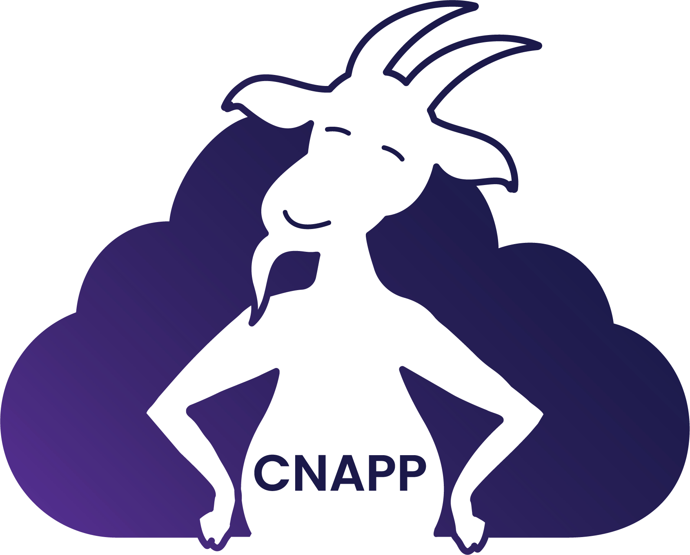

<div align="center">


# CNAPPgoat
</div>

CNAPPgoat is a multi-cloud, vulnerable-by-design environment deployment tool – specifically engineered to facilitate
practice arenas for defenders and pentesters. Its main function is to deploy intentionally
vulnerable environments across multiple cloud service providers, to help you sharpen your skills in exploiting,
detecting, and preventing such vulnerabilities.


> **Warning**: CNAPPgoat deploys vulnerable environments. Only use it within safe, controlled sandboxes.

With the cautionary note behind us, let's delve right in!

## Getting Started

CNAPPgoat operates as a Command Line Interface (CLI) tool, capable of deploying vulnerable environments to a multitude
of cloud service providers. Built with Go and utilizing Pulumi and the Pulumi automation API, it ensures seamless
environment deployment. One of its unique features is its modular design, which allows for effortless extension to
support an array of cloud service providers and new vulnerable environments. As of now, CNAPPgoat supports AWS, Azure,
and GCP.

### Prerequisites for running CNAPPgoat

- [Pulumi](https://www.pulumi.com/docs/get-started/install/)
- Cloud SDKs for the cloud provider you are using:
    - [AWS CLI](https://docs.aws.amazon.com/cli/latest/userguide/cli-chap-install.html)
    - [Azure CLI](https://docs.microsoft.com/cli/azure/install-azure-cli)
    - [Google Cloud SDK](https://cloud.google.com/sdk/docs/install)

Additional dependencies will
automatically install when you execute `go build` or `go run`. Pulumi dependencies will install on an on-demand basis
when you provision your first environment, meaning the first-time provisioning might take a bit longer than subsequent
ones.

### Installation

Download the latest release from [here](https://github.com/ermetic-research/CNAPPgoat/releases/latest)

    tar -xvf cnappgoat-<version>.tar.gz
    cd cnappgoat-<version>
    cnappgoat list

## External Scenarios

CNAPPgoat downloads scenarios from the [cnappgoat-scenarios](https://github.com/ermetic-research/cnappgoat-scenarios)
repository
at its first run of every day,
these scenarios are automatically downloaded when you run CNAPPgoat and are stored in the `~/.cnappgoat/scenarios`
directory.

### Usage

| Command     | Description                                                                                                          | Usage                                 |
|-------------|----------------------------------------------------------------------------------------------------------------------|---------------------------------------|
| `list`      | Lists all available scenarios for provisioning.                                                                      | `cnappgoat list`                      |
| `describe`  | Provides detailed information about the specified scenario.                                                          | `cnappgoat describe <scenario name>`  |
| `provision` | Provisions the scenario specified by the scenario name. To provision all scenarios, simply use `cnappgoat provision` | `cnappgoat provision <scenario name>` |
| `destroy`   | Destroys the scenario specified by the scenario name. To destroy all scenarios, simply use `cnappgoat destroy`       | `cnappgoat destroy <scenario name>`   |
| `clean`     | Cleans up all scenarios and deletes the `.cnappgoat` local directory                                                 | `cnappgoat clean `                    |   
| `version`   | Displays the current version of CNAPPgoat                                                                            | `cnappgoat version`                   |
| `help`      | Displays the help menu.                                                                                              | `cnappgoat help`                      |

You may use multiple arguments separated by spaces. For example:

```bash
cnappgoat provision <scenario name> <scenario name> <scenario name>
```

#### Flags:

- `--module` - Filters scenarios by module (e.g. CSPM, CIEM, CWPP, etc.)
- `--platform` - Filters scenarios by platform (e.g. AWS, Azure, GCP)
- `--force` - Enables force mode (unlock locked stacks with pulumi cancel)
- `--debug` - Enables debug logging.

These flags are command flags and should be placed after the commnad. for example:

```bash
cnappgoat provision --module CSPM --platform AWS
```

This command will provision all AWS CSPM scenarios.

## Setup and Configuration

Before you can use CNAPPgoat, you need to set up your cloud credentials for AWS, Azure, and GCP. CNAPPgoat uses the
default credentials for each provider. Follow the steps below to set up your credentials:

### AWS Credentials

1. Install the AWS CLI by following the
   instructions [here](https://docs.aws.amazon.com/cli/latest/userguide/cli-chap-install.html).

2. Configure your AWS credentials by running:

    ```bash
    aws configure
    ```

   You'll be prompted to enter your Access Key ID, Secret Access Key, and default region name.

### Azure Credentials

1. Install the Azure CLI by following the instructions [here](https://docs.microsoft.com/cli/azure/install-azure-cli).

2. Log in to your Azure account by running:

    ```bash
    az login
    ```

   This will open a new browser window for you to log in. After logging in, your credentials will be stored for future
   use.

### GCP Credentials

1. Install the Google Cloud SDK by following the instructions [here](https://cloud.google.com/sdk/docs/install).

2. Authenticate with Google Cloud by running:

    ```bash
    gcloud auth login
    ```

   This will open a new browser window for you to log in. After logging in, your credentials will be stored for future
   use.

By setting these credentials, you will be able to deploy scenarios on AWS, Azure, and GCP using CNAPPgoat. If you're
planning on using CNAPPgoat with a different provider, make sure to configure the credentials accordingly.

## Other Recommended Projects

CNAPPgoat provisions a breadth of vulnerable scenarios on multiple clouds to test detection and prevention capabilities.
There are other great projects out there for vulnerable cloud environments that are focused on different areas, such as
exploitation, detection, CTF (capture the flag) scenarios, etc. We recommend checking out the following projects:

* [Stratus Red Team by DataDog](https://github.com/DataDog/stratus-red-team): a tool that allows users , allowing to
  emulate offensive attack techniques in a granular and self-contained manner
* [Cloud Goat by Rhino Security Labs](https://github.com/RhinoSecurityLabs/cloudgoat): a "Vulnerable by Design" AWS
  deployment tool. It allows you to hone your cloud cybersecurity skills by creating and completing several "
  capture-the-flag" style scenarios
* [Kubernetes Goat by Madhu Akula](https://github.com/madhuakula/kubernetes-goat): an intentionally vulnerable cluster
  environment to learn and practice Kubernetes security
* [TerraGoat by Bridgecrew](https://github.com/bridgecrewio/terragoat): a "Vulnerable by Design" Terraform repository
* [CloudFoxable by BishopFox](https://github.com/BishopFox/cloudfoxable): a gamified cloud hacking sandbox

More challenges and tools can be found in
the [Awesome Cloud Security Challeges](https://github.com/mikeprivette/awesome-sec-challenges) repo by Mike Privitte,
our list focused specifically on vulnerable-by-design cloud environments that are deployed by users in their own
sandbox.

## Disclaimer

CNAPPgoat is provider "as is" and without any warranty or support.
